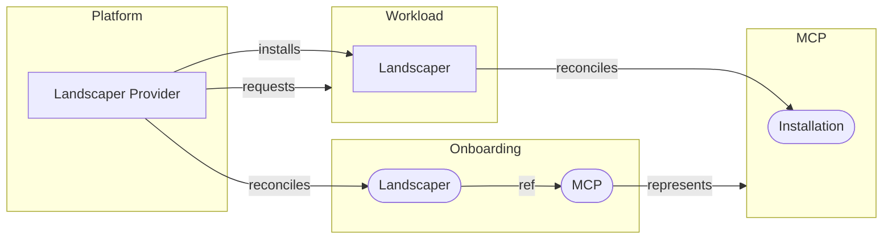

[](https://api.reuse.software/info/github.com/openmcp-project/service-provider-landscaper)

# Service Provider Landscaper

## About this project

Service Provider Landscaper manages the lifecycle of Landscaper instances.

### Provider Configuration

The Service Provider Landscaper requires a `ProviderConfig` resource to be present on the platform cluster of an OpenMCP landscape. 
This resource defines the container image repository and the available versions of the Landscaper instances that can be installed.

```yaml
apiVersion: landscaper.services.openmcp.cloud/v1alpha2
kind: ProviderConfig
metadata:
  name: default
  labels:
    landscaper.services.openmcp.cloud/providertype: default
spec:
  deployment:
    repository: europe-docker.pkg.dev/sap-gcp-cp-k8s-stable-hub/landscaper
    availableVersions:
      - v0.136.0
      - v0.137.0 
```

If the label `landscaper.services.openmcp.cloud/providertype` is set to `default`, the Service Provider Landscaper will automatically use this `ProviderConfig` resource.
The default provider configuration will be used by all Landscaper instances that are not explicitly defining a provider configuration name.

### Requesting a Landscaper

An OpenMCP user can request a Landscaper instance by creating a custom resource of kind `Landscaper` on the onboarding cluster of an OpenMCP landscape. A prerequisite is that the user has already created an `ManagedControlPlane` (MCP). Both resources, `ManagedControlPlane` and `Landscaper`, must have the same name and namespace.

For example, let's suppose an OpenMCP user has already created a `ManagedControlPlane` resource with name `sample` in namespace `project-x--workspace-y`. The user could then create the following `Landscaper` resource to use the MCP together with a Landscaper instance:

```yaml
apiVersion: landscaper.services.openmcp.cloud/v1alpha2
kind: Landscaper
metadata:
  name: sample
  namespace: project-x--workspace-y
spec:
  version: v0.136.0
```

If the Landscaper instance should use a specific provider configuration, the user can specify the name of the `ProviderConfig` resource in the `spec.providerConfigRef` field.

```yaml
apiVersion: landscaper.services.openmcp.cloud/v1alpha2
kind: Landscaper
metadata:
  name: sample
  namespace: project-x--workspace-y
spec:
  version: v0.120.0
  providerConfigRef:
    name: custom-provider
```

The Service Provider Landscaper will then install a Landscaper instance together with a helm and manifest deployer.


### Architecture Overview

The Service Provider Landscaper runs on the platform cluster of an OpenMCP landscape. It reconciles `Landscaper` resources and installs the corresponding Landscaper instances. Each Landscaper installed in this way runs on a so-called workload cluster and reconciles `Installation` resources on the MCP cluster.




## Requirements and Setup

The setup of the Service Provider Landscaper  within an OpenMCP landscape is described in: [Installing the Service Provider Landscaper](docs/technical/install.md).

## Support, Feedback, Contributing

This project is open to feature requests/suggestions, bug reports etc. via [GitHub issues](https://github.com/openmcp-project/service-provider-landscaper/issues). Contribution and feedback are encouraged and always welcome. For more information about how to contribute, the project structure, as well as additional contribution information, see our [Contribution Guidelines](CONTRIBUTING.md).

## Security / Disclosure
If you find any bug that may be a security problem, please follow our instructions at [in our security policy](https://github.com/openmcp-project/service-provider-landscaper/security/policy) on how to report it. Please do not create GitHub issues for security-related doubts or problems.

## Code of Conduct

We as members, contributors, and leaders pledge to make participation in our community a harassment-free experience for everyone. By participating in this project, you agree to abide by its [Code of Conduct](https://github.com/SAP/.github/blob/main/CODE_OF_CONDUCT.md) at all times.

## Licensing

Copyright 2025 SAP SE or an SAP affiliate company and service-provider-landscaper contributors. Please see our [LICENSE](LICENSE) for copyright and license information. Detailed information including third-party components and their licensing/copyright information is available [via the REUSE tool](https://api.reuse.software/info/github.com/openmcp-project/service-provider-landscaper).
