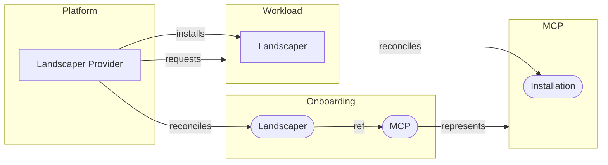

# Service Provider Landscaper

An MCP user can request a Landscaper by creating a `Landscaper` resource on the onboarding cluster of an MCP landscape. A prerequisite is that the user has already created an `MCP` resource with the same name and namespace.

The *Service Provider Landscaper* (or just *Landscaper Provider*) reconciles `Landscaper` resources and installs corresponding Landscaper instances. Each Landscaper installed in this way runs on a workload cluster and reconciles `Installation` resources on an MCP cluster.



## Landscaper Resource

```yaml
apiVersion: landscaper.services.openmcp.cloud/v1alpha1
kind: Landscaper
metadata:
  name: sample
  namespace: project-x--workspace-y
spec: {}
```

### Reference to the MCP

The MCP cluster watched by the landscaper is represented by an `MCP` resource. Both resources, `Landscaper` and `MCP` must have the same name and namespace. Therefore, the `Landscaper` resource needs no field to reference the `MCP`. 

### Deployers

The list of deployers is not configurable. We always deploy the helm and manifest deployer, but not the container deployer.
The `Landscaper` resource needs no field to specify the list of deployers. Something like this is **not** needed:

```yaml
spec:
  deployers:
    - helm
    - manifest
```

### Status

The status of a landscaper resource has conditions:

- `MCPClusterAvailable`
- `WorkloadClusterAvailable`
- `Installed`
- `Ready`

and a phase:

- `Progressing`
- `Ready`
- `Terminating`

and an `observedGeneration`.
