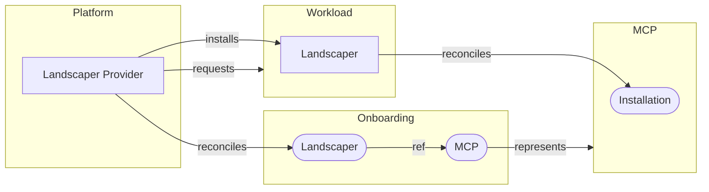

# Service Provider Landscaper

An MCP user can request a Landscaper by creating a `Landscaper` resource on the onboarding cluster of an MCP landscape. A prerequisite is that the user has already created an `MCP` resource with the same name and namespace.

The *Service Provider Landscaper* (or just *Landscaper Provider*) reconciles `Landscaper` resources and installs corresponding Landscaper instances. Each Landscaper installed in this way runs on a workload cluster and reconciles `Installation` resources on an MCP cluster.


```mermaid
flowchart LR
    
    subgraph Platform
        provider[Landscaper Provider]
    end

    subgraph onboarding_cluster[Onboarding]
        mcp([MCP])
        landscaper([Landscaper])
        landscaper -- ref --> mcp
    end

    subgraph workload_cluster[Workload]
        landscaper_controller[Landscaper]
    end

    subgraph mcp_cluster[MCP]
        installation([Installation])
    end

    provider -- reconciles --> landscaper
    provider -- requests --> workload_cluster
    provider -- installs --> landscaper_controller
    mcp -- represents --> mcp_cluster
    landscaper_controller -- reconciles --> installation
```

## ProviderConfig Resource

The `ProviderConfig` resource lives on the **platform cluster** and defines the container image registry and available versions for all Landscaper instances managed by the provider.

```yaml
apiVersion: landscaper.services.openmcp.cloud/v1alpha2
kind: ProviderConfig
metadata:
  name: default
  labels:
    landscaper.services.openmcp.cloud/providertype: default
spec:
  deployment:
    repository: ghcr.io/openmcp-project/components
    availableVersions:
      - v1.1.0
```

### The `repository` field

`repository` must be a **bare base OCI registry URL** — no trailing slash, and no component-specific path. The provider constructs each component's full image reference by appending a fixed OCI component path:

| Component | Appended path |
|---|---|
| Landscaper controller | `github.com/openmcp-project/landscaper/images/landscaper-controller` |
| Landscaper webhooks server | `github.com/openmcp-project/landscaper/images/landscaper-webhooks-server` |
| Helm deployer | `github.com/openmcp-project/landscaper/helm-deployer/images/helm-deployer-controller` |
| Manifest deployer | `github.com/openmcp-project/landscaper/manifest-deployer/images/manifest-deployer-controller` |

For example, with `repository: ghcr.io/openmcp-project/components` and version `v1.1.0`, the helm deployer image resolves to:
```
ghcr.io/openmcp-project/components/github.com/openmcp-project/landscaper/helm-deployer/images/helm-deployer-controller:v1.1.0
```

### Per-component overrides

To use a custom image for a specific component, set the corresponding override field instead of (or in addition to) `repository`:

```yaml
spec:
  deployment:
    repository: ghcr.io/openmcp-project/components
    availableVersions:
      - v1.1.0
    landscaperController:
      image: my.registry.example/custom-landscaper-controller
    landscaperWebhooksServer:
      image: my.registry.example/custom-webhooks-server
    helmDeployer:
      image: my.registry.example/custom-helm-deployer
    manifestDeployer:
      image: my.registry.example/custom-manifest-deployer
```

### Default ProviderConfig

If the label `landscaper.services.openmcp.cloud/providertype: default` is set, this `ProviderConfig` is used by all `Landscaper` resources that do not explicitly reference a provider configuration.

## Landscaper Resource

```yaml
apiVersion: landscaper.services.openmcp.cloud/v1alpha1
kind: Landscaper
metadata:
  name: sample
  namespace: project-x--workspace-y
spec: {}
```

### Reference to the MCP

The MCP cluster watched by the landscaper is represented by an `MCP` resource. Both resources, `Landscaper` and `MCP` must have the same name and namespace. Therefore, the `Landscaper` resource needs no field to reference the `MCP`. 

### Deployers

The list of deployers is not configurable. We always deploy the helm and manifest deployer, but not the container deployer.
The `Landscaper` resource needs no field to specify the list of deployers. Something like this is **not** needed:

```yaml
spec:
  deployers:
    - helm
    - manifest
```

### Status

The status of a landscaper resource has conditions:

- `MCPClusterAvailable`
- `WorkloadClusterAvailable`
- `Installed`
- `Ready`

and a phase:

- `Progressing`
- `Ready`
- `Terminating`

and an `observedGeneration`.


## Temporary Workaround

The OpenMCP project is still in an early stage. There are some temporary workarounds.

In the final scenario, the user has to create an MCP resource with some name <name> and namespace <namespace>. Temporarily, we skip the MCP resource, and assume that the kubeconfig for the MCP cluster can be obtained from a Secret with name `<name>.kubeconfig` in namespace `<namespace>`.

```shell
kubectl create secret generic <name>.kubeconfig -n <namespace> \
  --from-file=kubeconfig=<path to kubeconfig file of the mcp cluster>
```
Next the user has to create a Landscaper resource with the name <name> and namespace <namespace>.

```shell

```yaml
apiVersion: landscaper.services.openmcp.cloud/v1alpha1
kind: Landscaper
metadata:
  name: <name>
  namespace: <namespace>
spec: {}
```
