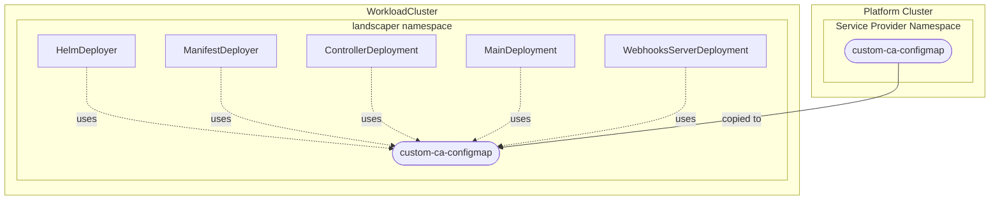

# Custom CA Bundle Configuration

## Overview

The `CABundleRef` property in the `ProviderConfig` allows you to configure custom Certificate Authority (CA) bundles for Landscaper instances. This is essential when your infrastructure uses private or self-signed certificates that need to be trusted by Landscaper.

## Use Cases

- **Private Source Registries**: When pulling Helm charts from registries with self-signed certificates
- **Air-gapped Environments**: When operating in isolated networks with custom certificate infrastructure

## Configuration

### ProviderConfig Specification

The `caBundleRef` field is an optional reference to a Kubernetes ConfigMap containing your custom CA certificate bundle:

```yaml
apiVersion: landscaper.services.openmcp.cloud/v1alpha2
kind: ProviderConfig
metadata:
  name: default
  labels:
    landscaper.services.openmcp.cloud/providertype: default
spec:
  # ... other configuration ...

  caBundleRef:
    name: custom-ca-bundle      # Name of the ConfigMap
    key: ca-bundle.crt          # Key within the ConfigMap containing the certificate bundle
```

### Creating the CA Bundle ConfigMap

First, create a ConfigMap in the Platform cluster containing your CA certificate bundle. The certificate bundle should be in PEM format and can contain multiple certificates concatenated together.

#### Example: Single CA Certificate

```yaml
apiVersion: v1
kind: ConfigMap
metadata:
  name: custom-ca-bundle
  namespace: openmcp-system  # Must be in the same namespace as the service-provider-landscaper
data:
  ca-bundle.crt: |
    -----BEGIN CERTIFICATE-----
    MIIDADCCAeigAwIBAgIUU0jjGMPVbvVbUen942ixQO2k2V4wDQYJKoZIhvcNAQEL
    BQAwGDEWMBQGA1UEAxMNc2VsZnNpZ25lZC1jYTAeFw0yNjAyMDkyMDQ5MTdaFw0y
    ... (certificate content) ...
    -----END CERTIFICATE-----
```

#### Example: Multiple CA Certificates

```yaml
apiVersion: v1
kind: ConfigMap
metadata:
  name: custom-ca-bundle
  namespace: openmcp-system
data:
  ca-bundle.crt: |
    -----BEGIN CERTIFICATE-----
    MIIDADCCAeigAwIBAgIUU0jjGMPVbvVbUen942ixQO2k2V4wDQYJKoZIhvcNAQEL
    ... (first certificate) ...
    -----END CERTIFICATE-----
    -----BEGIN CERTIFICATE-----
    MIIDADCCAeigAwIBAgIUU0jjGMPVbvVbUen942ixQO2k2V4wDQYJKoZIhvcNAQEL
    ... (second certificate) ...
    -----END CERTIFICATE-----
```

#### Creating from a Certificate File

If you have CA certificates in files, you can create the ConfigMap directly:

```bash
kubectl create configmap custom-ca-bundle \
  --from-file=ca-bundle.crt=/path/to/your/ca-bundle.crt \
  --namespace=openmcp-system
```

## How It Works



When you configure `spec.caBundleRef` in a ProviderConfig, the service provider reads the referenced ConfigMap (name/key) from the provider namespace on the platform cluster and copies it into the Landscaper instance namespace on the workload cluster.

Each Landscaper component (controller, main, webhooks, helm deployer, manifest deployer) mounts the copied ConfigMap as a volume named `custom-ca-bundle` at `/etc/open-control-plane/custom-ca`. Only the selected ConfigMap key is mounted as a file with the key as filename `/etc/open-control-plane/custom-ca/<configmap-key>`.

To make the bundle effective, the pods set `SSL_CERT_DIR=<default-cert-dirs>:/etc/open-control-plane/custom-ca`. This keeps the system trust store and extends it with your custom CA bundle.

**Notice:** If your container runtime also needs to trust a private registry, install the CA bundle on the cluster nodes as well.