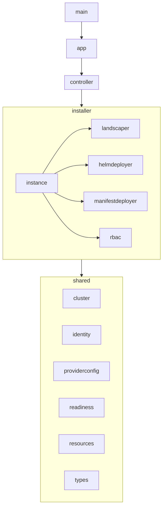

# Packages

## Dependencies

### install

Installs one instance of the landscaper. Entrypoint is in the [install.instance](#installinstance) package.

### install.instance

Installs one instance of the landscaper. The instance consists of the landscaper controllers, webhooks server, manifest deployer, helm deployer.

### installer.landscaper

Installs the landscaper controllers, and the webhook server.

### installer.helmdeployer

Installs the helm deployer.

### installer.manifestdeployer

Installs the manifest deployer.

### installer.rbac

Installs the rbac resources on the mcp cluster.
This will be replaced by access requests.
